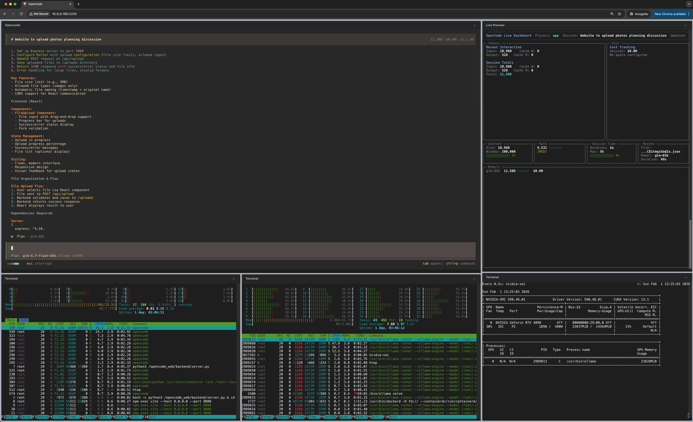

# OpenCode Web
**OpenCode Web** is a containerized environment designed to run remote OpenCode instances via a web interface. It provides a robust, VS Code-inspired layout for seamless remote development and terminal management.


## Installation
```bash
# Copy docker-compose to your project directory
docker compose up -d
```

## 🚀 Key Features

* **Mosaic Layout Engine**:
    * VS Code-like mosaic layout, allowing you to drag, drop, and rearrange tabs freely to create your ideal workspace.

* **Live Resource Monitoring**: <br/>
    * Built-in dashboard to track token usage, session costs, and context window size in real-time.

* **Integrated Multi-Terminal Support**:
    * Open new terminals instantly with `Ctrl` + `Shift` + `X`.
    * Manage multiple CLI sessions in organized tabs, providing a much cleaner experience than multiple independent SSH windows.



<!--
docker compose 會生成folders，以下是其用途
session_history： cached token record, 避免清除container後token記錄消失

opencode_cfg: 即是 .config/opencode/ , 用來存放opencode的主要配置文件 `opencode.json`
vide_code_dir: Project Directory , 用來存放用戶的代碼文件, 如果想掛載自己的代碼庫，可以於docker-compose.yaml 將此文件夾替換成自己的代碼庫路徑

 -->
## Directory Structure
Once you run `docker compose up`, the following directories are generated for data persistence and configuration stability.

| Directory | Purpose |
| :--- | :--- |
| **`session_history`** | Stores cached token records. This prevents loss of authentication or session data when the container is stopped, removed, or updated. |
| **`opencode_cfg`** | Maps to `.config/opencode/`. This directory houses the primary configuration file, `opencode.json`, allowing your settings to persist across sessions. |
| **`vide_code_dir`** | The **Project Directory**. This is where user source code is stored. |

---

### 💡 Exisitng Projects
If you wish to mount an existing local project into the container, update `docker-compose.yaml` file as follows:

```yaml
services:
  your-service-name:
    volumes:
      # Replace the path to your local repository
      - /path/to/your/local/code/:/app